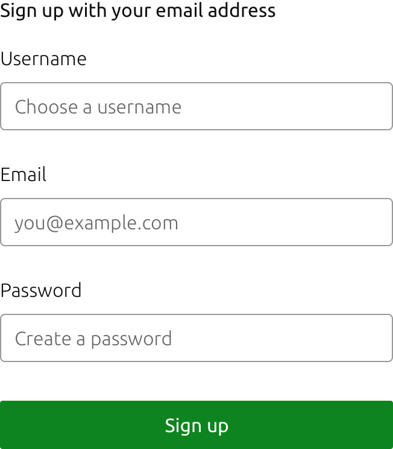
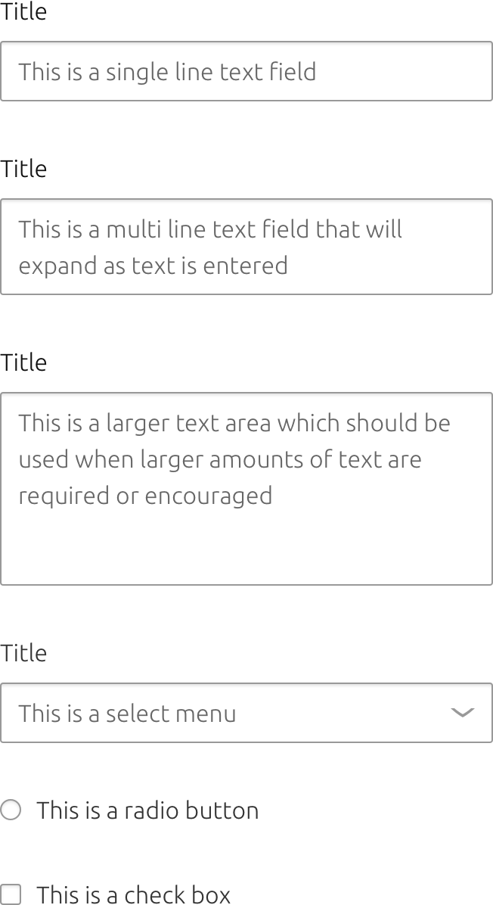

	

	  

	    <h2 id="our-sass-framework">Colour</h2>
	    
Colour can help to understand content hierarchy, indicate UI states, and express brand values.

			

				
			

			Example of a form with labels, input fields, and main call to action
	  

	

  

    

      
We have a neutral grey color palette, plus a range of colours with semantic meaning.

			

				
			

			Example of a form for a payment flow
    

  

  

    

      <h2 id="our-work-practices">Usage</h2>
      
The neutral colours in the palette should be used for:

      <ul class="p-list">
        <li class='guideline'>#FFFFFF - page backgrounds</li>
				<li class='guideline'>#F7F7F7 - backgrounds</li>
				<li class='guideline'>#E5E5E5 - backgrounds and page furniture</li>
				<li class='guideline'>#CDCDCD - page furniture</li>
				<li class='guideline'>#999999 - borders</li>
				<li class='guideline'>#666666 - icons and secondary text</li>
				<li class='guideline'>#111111 - text</li>
      </ul>
			
The semantic colours in the palette should be used for:

      <ul class="p-list">
        <li class='guideline'>#C7162B - errors and negative actions</li>
				<li class='guideline'>#F99B11 - caution</li>
				<li class='guideline'>#0E8420 - success and positive actions</li>
				<li class='guideline'>#335280 - information and selected states</li>
				<li class='guideline'>#007AA6 - links</li>
      </ul>
			

				
			

			Different types of user inputs
    

  

  

    

      <h2 id="our-work-practices">Contrast</h2>
			
When combined thoughtfully, the colours in our palette can give greater emphasis to content through the use of contrast.

		

	

  

    

      <h2 id="our-work-practices">UI states</h2>
      
We can also use colour to indicate the current state and any changes in state of a UI element or application.

			
Example states:

				<ul class="p-list">
					<li class='guideline'>Enabled</li>
					<li class='guideline'>Disabled</li>
					<li class='guideline'>Hover</li>
					<li class='guideline'>Pressed</li>
					<li class='guideline'>Selected</li>
					<li class='guideline'>Active</li>
					<li class='guideline'>In error</li>
					<li class='guideline'>Pending</li>
					<li class='guideline'>Successfully completed</li>
					<li class='guideline'>Failed</li>
				</ul>
			
Colours to use:

				<ul class="p-list">
					<li class='guideline'>Hover - #E5E5E5</li>
					<li class='guideline'>Positive - #0E8420</li>
					<li class='guideline'>Negative - #C7162B</li>
					<li class='guideline'>Caution - #F99B11</li>
					<li class='guideline'>Selected - #335280</li>
					<li class='guideline'>Link - #007AA6</li>
				</ul>
			

				
			

			Different states of user inputs
    

  

  

    

      <h2 id="our-work-practices">Brand</h2>
      
If a product has its own brand colour it can be used instead of the neutral palette where appropriate. However, we recommend that semantic colours are not altered.

			

				
			

			Different states of user inputs
    

  

  

    

      <h2>Links</h2>
			
<a href="https://docs.vanillaframework.io/en/settings/color-settings">Vanilla Docs for colour</a>

      
<a href="#" class="p-button--brand">Download the Sketch file</a>

    

  

