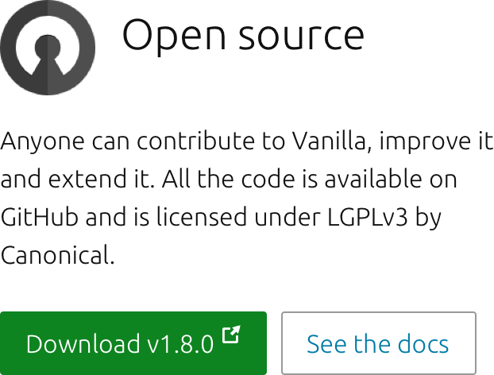
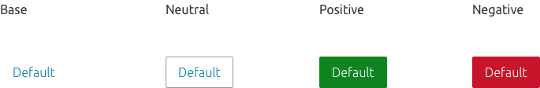
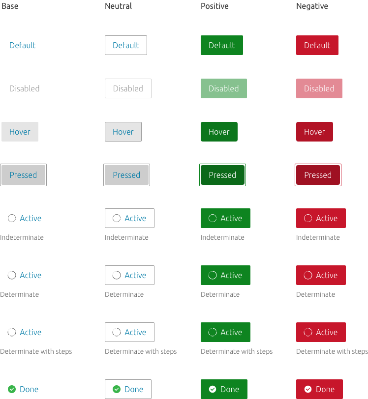
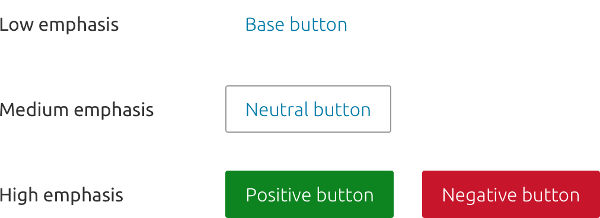
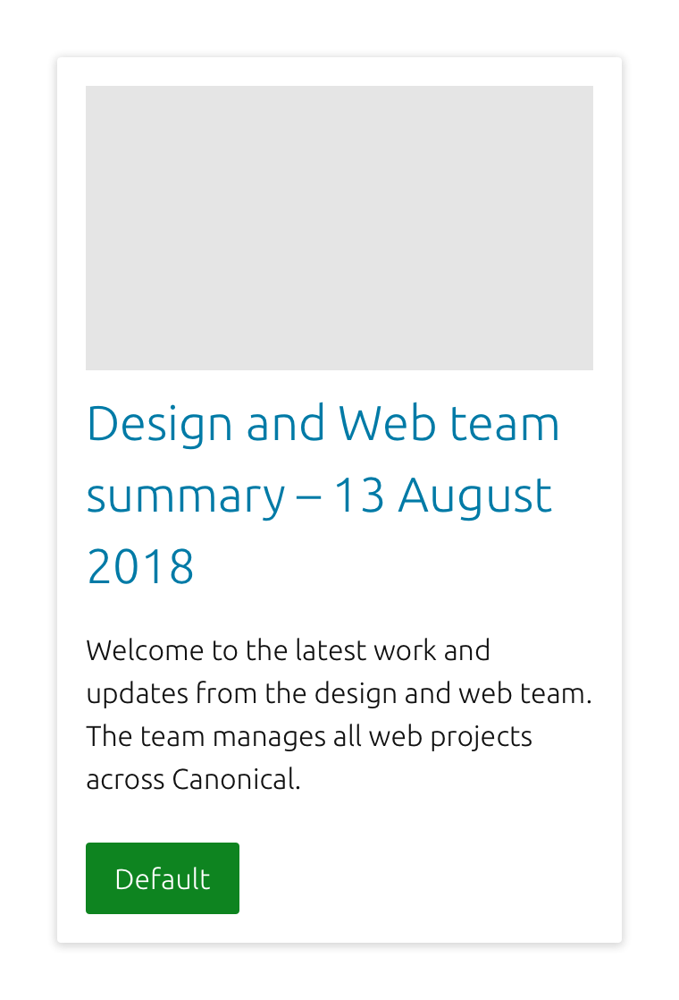
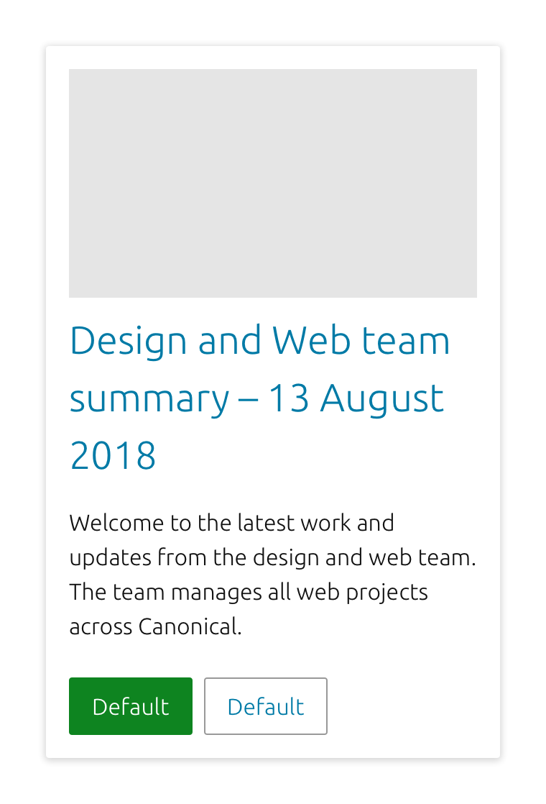
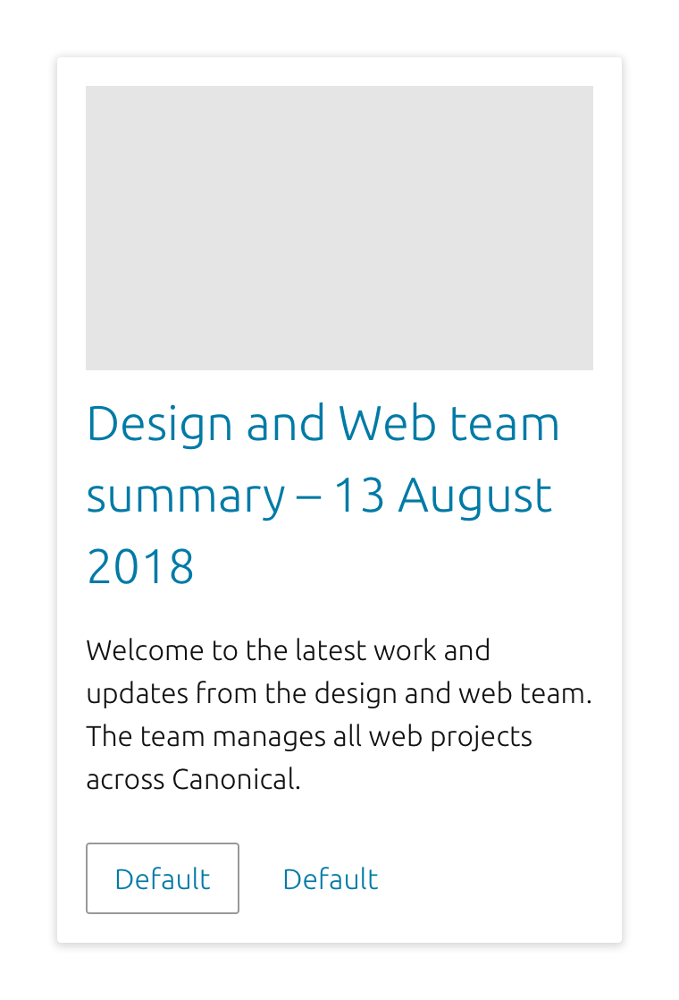

	

	  

	    <h2 id="our-sass-framework">Buttons</h2>
	    
Buttons describe an action that will occur when the user clicks or taps it. They can also give actions different levels of emphasis within the UI.

			

				
			

			Example of buttons in context
	  

	

  

    

      <h2 id="our-work-practices">Usage</h2>
      
Buttons can be used in many places and contexts, for example:

      <ul class="p-list">
        <li class='guideline'>Forms</li>
				<li class='guideline'>Tables views</li>
				<li class='guideline'>Cards</li>
				<li class='guideline'>Modal windows</li>
				<li class='guideline'>Dialogs</li>
      </ul>
    

  

  

    

      <h2 id="our-work-practices">Types</h2>
      
We have four different button types, to use for different levels of emphasis.

      <ul class="p-list">
        <li class='guideline'>Neutral</li>
				<li class='guideline'>Positive</li>
				<li class='guideline'>Negative</li>
				<li class='guideline'>The above with animation / icons</li>
				<li class='guideline'>The above at large and small sizes</li>
      </ul>
			

				
			

			Types of buttons
			 
			

				
			

			States of buttons
			 
			

				<video autoplay>
					<source src="../imgs/buttons/positivebtn.mp4" type="video/mp4">
					Your browser does not support the video tag.
				</video>
				<video autoplay>
					<source src="../imgs/buttons/negativebtn.mp4" type="video/mp4">
					Your browser does not support the video tag.
				</video>
			

    

  

  

    

      <h2 id="our-work-practices">Hierarchy</h2>
      
Our buttons are designed to be used with other UI elements to give different levels of visual emphasis.

			<ul class="p-list">
        <li class='guideline'>High emphasis</li>
				<li class='guideline'>Positive button</li>
				<li class='guideline'>Negative button</li>
        <li class='guideline'>Medium emphasis</li>
				<li class='guideline'>Neutral button</li>
        <li class='guideline'>Low emphasis</li>
				<li class='guideline'>Base button</li>
			</ul>
			

				
			

			Example of hierarchy among buttons
    

  

  

    

      <h2 id="our-work-practices">Grouping</h2>
			<ul class="p-list"> 
        <li><h5>Positive</h5></li>
				<li>
				

					
				

				 
				Try to only use one positive or negative button per page if the content allows. This will help the user to understand the main purpose of the page and the required action.</li> 
        <li><h5>Positive and neutral</h5></li>
				<li>
				

					
				

				 
				If a positive or negative button requires a supporting action the neutral button should be used</li> 
        <li><h5>Positive and base</h5></li>
				<li>
				

					
				

				 
				If the supporting action does not require the prominence given by a neutral button, the base style can be used.</li> 
				<li><h5>Neutral and base</h5></li>
				<li>
				

					
				

				 
				This combination should be used on pages where a positive or negative button has already been used, on pages with many buttons, or on pages where prominence is less important.</li>
			</ul>
			 
    

  

  

    

      <h2>Links</h2>
			
<a href="https://docs.vanillaframework.io/en/patterns/buttons">Vanilla Docs for buttons</a>

      
<a href="#" class="p-button--brand">Download the Sketch file</a>

    

  

