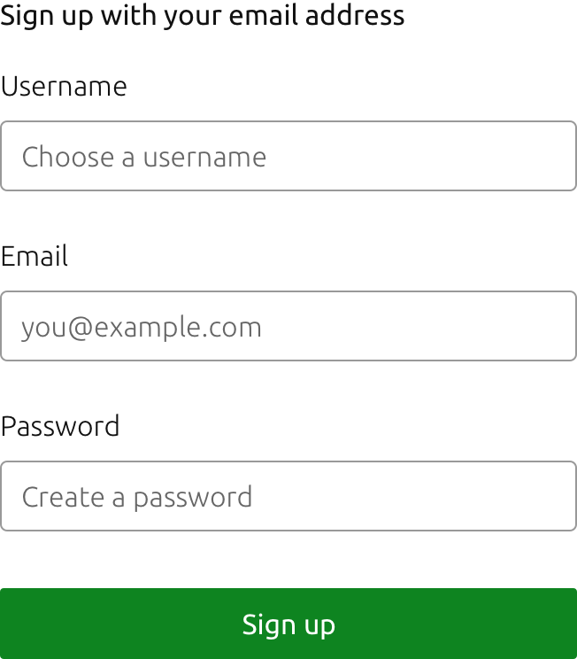
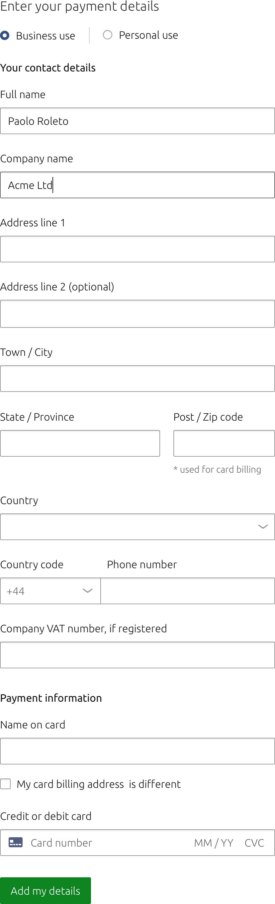
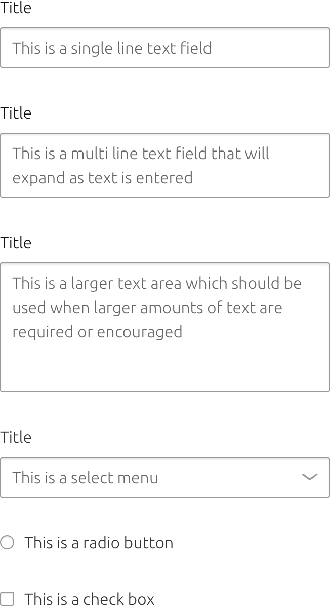
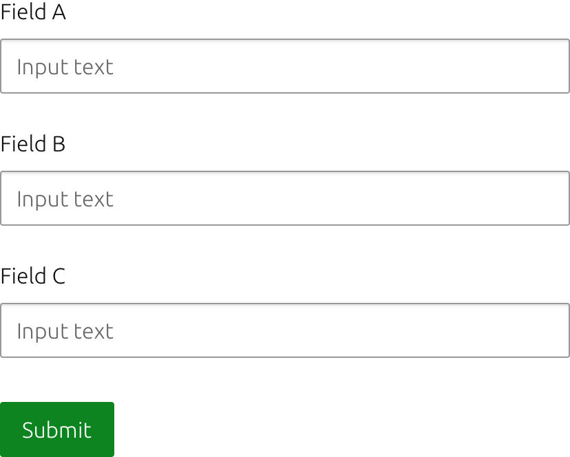
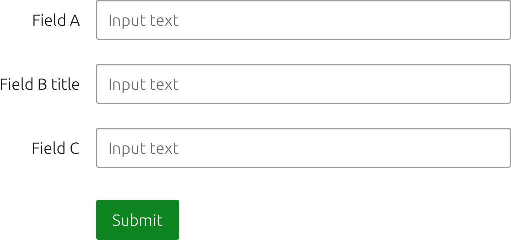
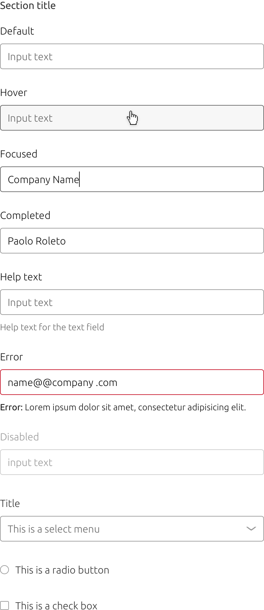

	

	  

	    <h2 id="our-sass-framework">Forms</h2>
	    
Forms allow the user to easily submit and edit information.

			

				
			

			Example of a form with labels, input fields, and main call to action
	  

	

  

    

      <h2 id="our-work-practices">Usage</h2>
      
The different form elements can be used in multiple situations such as signing up for a product, entering personal details, making a payment or completing a task in a dialog.

			

				
			

			Example of a form for a payment flow
    

  

  

    

      <h2 id="our-work-practices">Types</h2>
      
There a 6 types of user input:

      <ul class="p-list">
        <li class='guideline'>Single line fields</li>
				<li class='guideline'>Multi line fields</li>
				<li class='guideline'>Text areas</li>
				<li class='guideline'>Select menu</li>
				<li class='guideline'>Checkbox</li>
				<li class='guideline'>Radio button</li>
      </ul>
			

				
			

			Different types of user inputs
    

  

  

    

      <h2 id="our-work-practices">Grouping</h2>
			
There are 3 types of form grouping available depending on the page layout you are using.

			<ul class="p-list"> 
        <li><h5>Vertical</h5></li>
				<li>
				

					
				

				 
				Recommended for most layouts.</li> 
        <li><h5>Horizontal</h5></li>
				<li>
				

					
				

				 
				Recommended for compact layouts.</li> 
        <li><h5>Inline</h5></li>
				<li>
				

					
				

				 
				Recommended for use in tables</li>
			</ul>
			 
    

  

  

    

      <h2 id="our-work-practices">States</h2>
      
The states of our text fields clearly reflect the user action.

      <ul class="p-list">
        <li class='guideline'>Enabled</li>
				<li class='guideline'>Disabled</li>
				<li class='guideline'>Focused</li>
				<li class='guideline'>Text added</li>
				<li class='guideline'>Error</li>
      </ul>
			

				
			

			Different states of user inputs
    

  

  

    

      <h2>Links</h2>
			
<a href="https://docs.vanillaframework.io/en/base/forms">Vanilla Docs for forms</a>

      
<a href="#" class="p-button--brand">Download the Sketch file</a>

    

  

